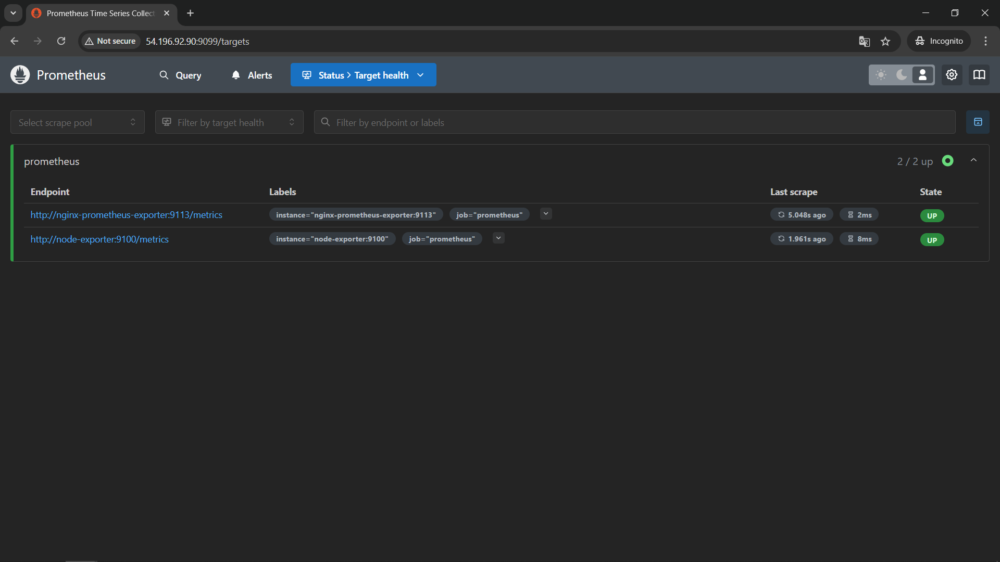
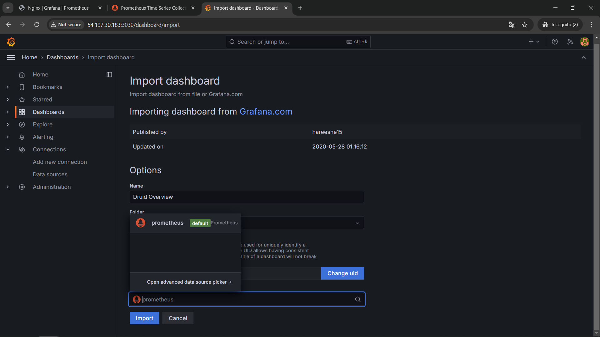
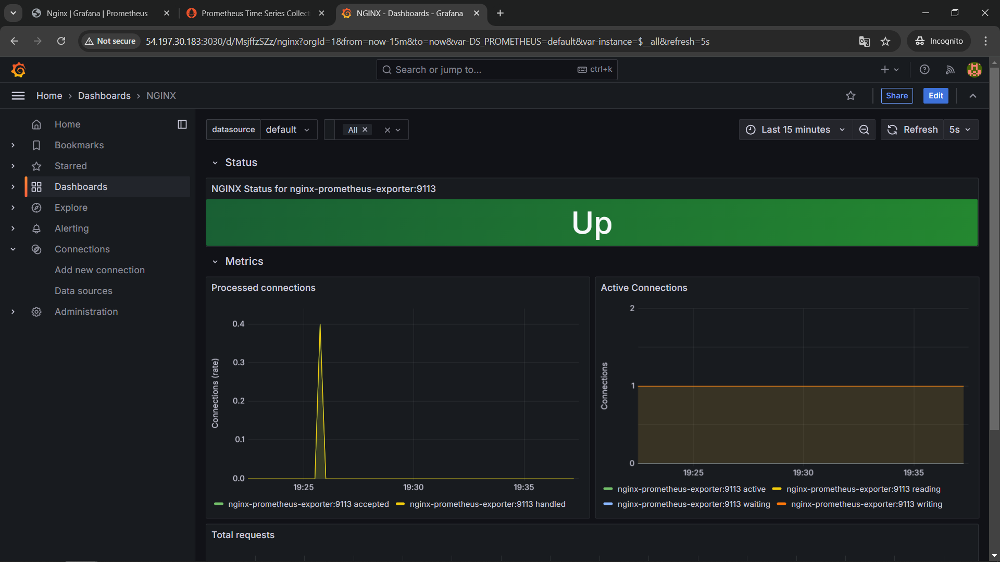
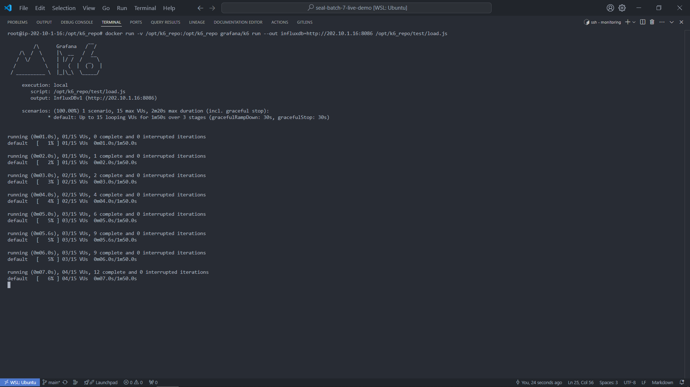
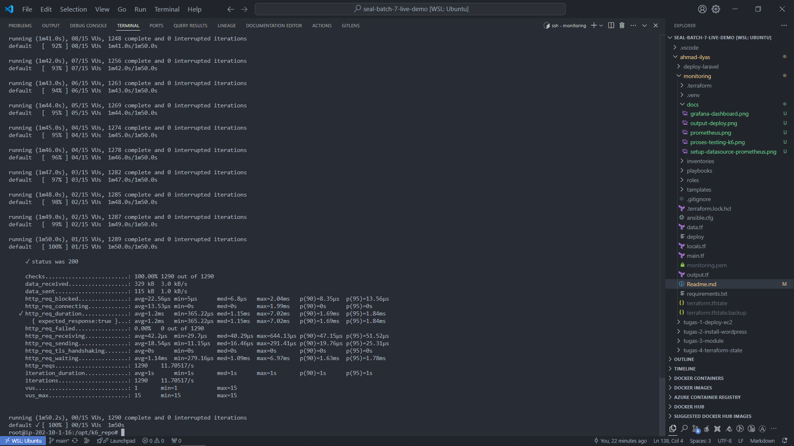

# **Setup Monitoring Prometheus dan Grafana dengan Terraform dan Ansible**

Dokumen ini menjelaskan cara menyiapkan infrastruktur monitoring menggunakan **Terraform** dan **Ansible**, mengkonfigurasi **Prometheus** dan **Grafana**, serta melakukan pengujian dengan **K6**.

## **1. Persiapan Awal**
### **Prasyarat**
1. Pastikan **Terraform** telah terinstal di mesin lokal Anda.
2. Akses ke AWS dengan kredensial yang valid di:  
   ```
   /root/.aws/credentials
   ```
3. Clone repositori berikut:  
   ```bash
   git clone https://github.com/juniyasyos/seal-batch-7-live-demo.git
   ```
## **2. Langkah Penggunaan**
### **a. Jalankan Perintah Deploy**
Dengan satu perintah berikut, infrastruktur server dan instalasi akan dibuat secara otomatis dan dengan perintah ini maka anda akan mengotatisasi semua hal.
```bash
cd /root/seal-batch-7-live-demo/ahmad-ilyas/monitoring/
chmod +x ./nyantai
./nyantai
```
---

## **3. Setup Prometheus dan Grafana**
### **a. Akses Prometheus**
1. Buka browser Anda dan akses:  
   ```
   http://<public-ip-tag-monitoring-testing-k6>:9099
   ```
   Untuk IP server, lihat output terakhir dari `./deploy`, yang mencantumkan dua instance. Pilih IP dengan tag:  
   **`tag_monitoring_testing_k6`**

2. Verifikasi *target status* di Prometheus:  
   

---

### **b. Login ke Grafana**
1. Buka browser Anda dan akses Grafana:  
   ```
   http://<public-ip-instance-tag-learning-monitoring>:3030
   ```
2. Login dengan kredensial berikut:  
   - **Username:** `admin`  
   - **Password:** `my-password-grafana`  

---

### **c. Setup Dashboard Grafana**
1. Masuk ke menu **"Create" > "Import"** di Grafana.  
2. Gunakan file dashboard.json dari repositori berikut:  
   ```
   https://github.com/nginxinc/nginx-prometheus-exporter/blob/main/grafana/dashboard.json
   ```
3. Pilih data source **Prometheus** (tambahkan secara manual jika tidak ada), lalu klik **Import**.  

   

4. Verifikasi tampilan dashboard sesuai contoh berikut

   

---

## **4. Melakukan Testing dengan Grafana K6**
### **a. Persiapan Instance Testing**
1. untuk melakukan testing berulang ulang cukup menjalanan perintah:
   ```bash
   ansible-playbook ./playbooks/docker-santuy/main.yaml --tags load_test 
   ```

---

### **b. Membuat Script Custom Pengujian K6 (belum Tersedia)**
Buat file `load.js` di dalam direktori `/opt/k6_repo/test/` dengan isi berikut:

```javascript
import http from "k6/http";
import { check, sleep } from "k6";

// Test configuration
export const options = {
    thresholds: {
        // Assert that 99% of requests finish within 3000ms
        http_req_duration: ["p(99) < 3000"],
    },
    stages: [
        { duration: "30s", target: 15 },
        { duration: "1m", target: 15 },
        { duration: "20s", target: 0 },
    ],
};

// Simulated user behavior
export default function () {
    let res = http.get("http://<ip-nginx-target>/stub_status");
    check(res, { "status was 200": (r) => r.status == 200 });
    sleep(1);
}
```
- **`<ip-nginx-target>`** adalah IP instance Nginx Anda (yang menjalankan Nginx dan Prometheus).

---

### **c. Overview Pengujian dengan docker up Grafana K6**
Gunakan perintah berikut untuk menjalankan pengujian:
```bash
docker run -v /opt/k6_repo:/opt/k6_repo grafana/k6 run --out influxdb=http://<ip-vm-testing>:8086 /opt/k6_repo/test/load.js
```
- **`<ip-vm-testing>`** adalah IP instance yang menjalankan InfluxDB dan ip yg digunakan bisa private atau public. 

maka akan terjadi proses seperti ini 





dan gambar dibawah ini merupakan bukti bahwa pengujian berjalan dengan baik


Berikut penjelasan dari output tersebut:

- **Tes berhasil**: Semua permintaan HTTP berhasil dengan status 200, tanpa ada yang gagal.
- **Kecepatan**: Rata-rata server merespons dalam 1.2ms, sangat cepat.
- **Data**: 329 kB data diterima dan 115 kB data dikirim.
- **Kecepatan permintaan**: 11.7 permintaan per detik.
- **Virtual Users (VUs)**: Tes dilakukan dengan 1 hingga 15 pengguna virtual, dengan 1290 permintaan total.

tes menunjukkan performa yang baik dan server berfungsi dengan sangat baik.

---

### **Catatan Penting**
- **Jaringan Internal atau Public:**  
  Jika menggunakan private IP, pastikan kedua instance berada dalam satu VPC atau jaringan lokal. Jika menggunakan public IP, pastikan security group dan firewall mengizinkan koneksi.

- **Validasi Script:**  
  Cek endpoint Nginx (`/stub_status`) dengan curl:  
  ```bash
  curl http://<ip-nginx-target>/stub_status
  ```

---

Dengan langkah-langkah ini, Anda akan dapat melakukan pengaturan monitoring menggunakan Prometheus, Grafana, dan menguji beban dengan K6. 🎉